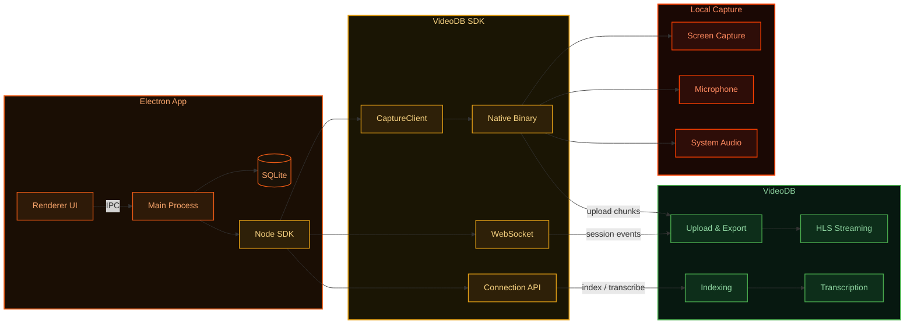

<!-- PROJECT SHIELDS -->
[![Electron][electron-shield]][electron-url]
[![Node][node-shield]][node-url]
[![License][license-shield]][license-url]
[![Stargazers][stars-shield]][stars-url]
[![Issues][issues-shield]][issues-url]
[![Website][website-shield]][website-url]

<!-- PROJECT LOGO -->
<br />
<table align="center" border="0" cellspacing="0" cellpadding="0">
  <tr>
    <td valign="middle"><a href="https://videodb.io/"></a></td>
    <td valign="middle"></td>
    <td valign="middle"><a href="https://videodb.io/"></a></td>
  </tr>
</table>

<p align="center">
  A Loom-style screen recording app built with Electron and the VideoDB Capture SDK.
  <br />
  <a href="https://docs.videodb.io"><strong>Explore the docs »</strong></a>
  <br />
  <br />
  <a href="#features">View Features</a>
  ·
  <a href="#installation">Installation</a>
  ·
  <a href="https://github.com/video-db/bloom/issues">Report Bug</a>
</p>

---

## Installation

Run this in your terminal to install Bloom:

```bash
curl -fsSL https://artifacts.videodb.io/bloom/install | bash
```

This will automatically detect your Mac architecture, download the right build, and install it to `/Applications`.

<details>
<summary>Manual install</summary>

- **Apple Silicon (M1/M2/M3/M4)**: [bloom-2.0.0-arm64.dmg](https://artifacts.videodb.io/bloom/bloom-2.0.0-arm64.dmg)
- **Apple Intel**: [bloom-2.0.0-x64.dmg](https://artifacts.videodb.io/bloom/bloom-2.0.0-x64.dmg)

1. Mount the DMG and drag Bloom to your Applications folder
2. Open Terminal and run `xattr -cr /Applications/Bloom.app`
3. Launch the app from Applications or Spotlight

</details>

<p>
  <em>Pre-built builds are available for macOS. Linux support coming soon.</em>
</p>

---

## Getting Started

1. **Grant system permissions** when prompted (Microphone and Screen Recording are required)

2. **Enter your VideoDB API key** on first launch ([console.videodb.io](https://console.videodb.io))

---

## Features

- **Screen recording** — Capture screen, microphone, and system audio via [VideoDB Capture SDK](https://docs.videodb.io/pages/ingest/capture-sdks)
- **Camera overlay** — Draggable camera bubble during recording
- **Floating bar** — Always-on-top control bar that never blocks your apps
- **Multi-monitor** — Display picker to choose which screen to record
- **Library** — Browse, search, play, rename, and download recordings
- **Transcription** — Automatic transcript generation with subtitled playback
- **Chat with video** — Ask questions about your recording via [VideoDB Chat](https://chat.videodb.io)
- **Share** — One-click shareable link for any recording
- **Keyboard shortcut** — `Cmd+Shift+R` to start/stop recording from anywhere

## Development Setup

### Prerequisites

- Node.js 18+
- VideoDB API Key ([console.videodb.io](https://console.videodb.io))

### Quick Start

```bash
npm install
npm start
```

On first launch, grant microphone and screen recording permissions, then enter your name and VideoDB API key.

## Usage

1. **Connect** — Enter your name and API key on first launch
2. **Record** — Click "Start Recording" to capture screen, mic, and system audio
3. **Camera** — Toggle the camera bubble overlay from source controls
4. **Library** — Open the Library to browse recordings, play them inline, and manage downloads
5. **Share** — Click "Copy Link" on any recording to generate and copy a share link
6. **Download** — Use the split download button to save the video file or transcript

## Architecture



**Recording flow:** The app creates a `CaptureClient` which spawns a native binary to capture screen, mic, and system audio. Chunks are uploaded to VideoDB Cloud in real-time. A WebSocket connection delivers session events (started, stopped, exported) back to the app.

**Post-recording:** Once the video is exported, the app calls the VideoDB API to index spoken words, generate a transcript, and create a subtitled stream — all available for in-app HLS playback or sharing via URL.

## Project Structure

```
src/
├── main/                       # Electron Main Process
│   ├── index.js                # App entry, windows, tray, IPC routing
│   ├── db/
│   │   └── database.js         # SQLite via sql.js
│   ├── ipc/                    # IPC handlers
│   │   ├── capture.js          # Recording start/stop, channels, devices
│   │   ├── permissions.js      # Permission check/request/open settings
│   │   ├── camera.js           # Camera bubble control
│   │   └── auth.js             # Login, logout, onboarding
│   ├── lib/                    # Utilities
│   │   ├── config.js           # App config
│   │   ├── logger.js           # File + console logging
│   │   ├── paths.js            # App paths (DB, config, logs)
│   │   └── videodb-patch.js    # Binary relocation for packaged apps
│   └── services/
│       ├── videodb.service.js  # VideoDB SDK wrapper
│       ├── session.service.js  # Session tokens, WebSocket, sync
│       └── insights.service.js # Transcript + subtitle indexing
├── renderer/                   # Renderer (context-isolated)
│   ├── index.html              # Floating bar page
│   ├── renderer.js             # Bar init + event routing
│   ├── permissions.html        # Permissions modal window
│   ├── onboarding.html         # Onboarding modal window
│   ├── history.html            # Library window
│   ├── history.js              # Library — list, player, download, share, sync
│   ├── display-picker.html     # Display picker popup
│   ├── camera.html             # Camera bubble
│   ├── ui/
│   │   └── bar.js              # Bar controls, toggles, timer, devices
│   ├── utils/
│   │   ├── permissions.js      # Permission check/request utility
│   │   └── logger.js           # Renderer-side logging
│   └── img/                    # Icons, brand assets, animated previews
└── preload/
    └── index.js                # Context bridge (renderer ↔ main)

build/
├── afterPack.js                # electron-builder hook (codesign, plist patch)
├── entitlements.mac.plist      # macOS entitlements
└── icon.icns                   # App icon
```

## Troubleshooting

### Permissions denied
- **macOS**: System Settings → Privacy & Security → enable Screen Recording / Microphone / Camera

### Camera not showing
- Toggle camera off/on in source controls
- Check Camera permission in system settings

### Reset
```bash
# Delete the app database (stored in Electron userData)
# macOS
rm ~/Library/Application\ Support/bloom/bloom.db
rm ~/Library/Application\ Support/bloom/config.json
```
Then relaunch the app.

## License

MIT

## Community & Support

- **Docs**: [docs.videodb.io](https://docs.videodb.io)
- **Issues**: [GitHub Issues](https://github.com/video-db/bloom/issues)
- **Discord**: [Join community](https://discord.gg/py9P639jGz)
- **Console**: [Get API key](https://console.videodb.io)

---

<p align="center">Made with ❤️ by the <a href="https://videodb.io">VideoDB</a> team</p>

<!-- MARKDOWN LINKS & IMAGES -->
[electron-shield]: https://img.shields.io/badge/Electron-39.0-47848F?style=for-the-badge&logo=electron&logoColor=white
[electron-url]: https://www.electronjs.org/
[node-shield]: https://img.shields.io/badge/Node.js-18+-339933?style=for-the-badge&logo=node.js&logoColor=white
[node-url]: https://nodejs.org/
[license-shield]: https://img.shields.io/github/license/video-db/bloom.svg?style=for-the-badge
[license-url]: https://github.com/video-db/bloom/blob/main/LICENSE
[stars-shield]: https://img.shields.io/github/stars/video-db/bloom.svg?style=for-the-badge
[stars-url]: https://github.com/video-db/bloom/stargazers
[issues-shield]: https://img.shields.io/github/issues/video-db/bloom.svg?style=for-the-badge
[issues-url]: https://github.com/video-db/bloom/issues
[website-shield]: https://img.shields.io/website?url=https%3A%2F%2Fvideodb.io%2F&style=for-the-badge&label=videodb.io
[website-url]: https://videodb.io/
